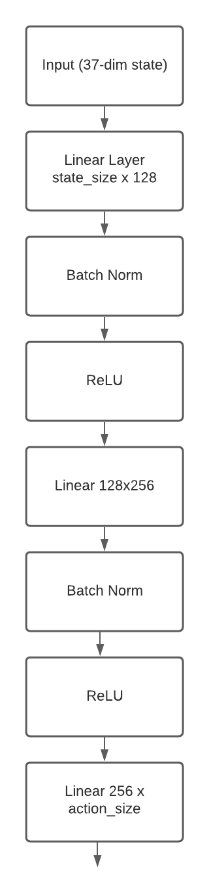
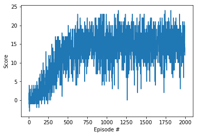

# Report

## Algorithm
The agent used to solve this project primarily makes use of [Deep Q Learning](https://arxiv.org/abs/1312.5602), which simply described, **makes use of a trained deep neural network to simulate the Q-table in a classic Q-learning (Sarsa) reinforcement learning algorithm**. In addition the classic Deep Q Learning algorithm, the solution additionally makes use of the following improvements to the base algorithm:

* **[Action Replay using a Replay Buffer](https://arxiv.org/abs/1312.5602)**: This optimization to the base algorithm works by staggering backpropagation updates to the base Q-network by first collecting a large batch of (state, action, reward, next-state) tuples and replaying them in a random fashion. Doing so, not only helps break any sequential biases which the network may learn, but also helps convert a reinforcement learning problem into a more straightforward supervised learning problem. 
* **[Fixed Q targets](https://arxiv.org/abs/1312.5602)**: This particular optimization keeps two copies of the network when running the algorithm. A **local q-network** which updates using standard backpropagation and a **target q-network** which is updated very slowly in comparison. The target q-network is used to compute the reward for the next-state which is then used to update the state of the local q-network based on the expected reward from the state. Doing so avoids the q-network from "chasing a moving target" problems which may result from updating the local q-networks based on its own predictions. 
* **[Double Q Learning](https://arxiv.org/abs/1509.06461)**: Deep Q Learning [tends to overestimate the action values](https://www.ri.cmu.edu/pub_files/pub1/thrun_sebastian_1993_1/thrun_sebastian_1993_1.pdf) in its classic implementation. Double Q Learning has been shown to empirically help with this. This version of the algorithm makes use of the local q-network to compute the action values for the next state, but the target q-network to compute the rewards for those actions. This simple change makes the algorithm more robust to overestimation.

**Please note that the code-skeleton for the deep-q-learning agent and the network is taken from the [reference Udacity lessons on DQN](https://github.com/udacity/deep-reinforcement-learning/tree/master/dqn)**

## Network Architecture
The architecture of the Deep-Q-Network is shown in the image below:




The architecture above was chosen based on a lot of empirical testing to see what size of network yielded optimal performance. The linear layers of the network are initialized using **[Kaiming Initialization](https://arxiv.org/abs/1502.01852)**. This was shown to improve the performance of the network empirically.

## Hyperparameter Choice

The following is the list of hyperparameters of the DQN algorithm. *Most of the parameters were chosen by simple empirical experimentation to see what worked best with the problem.*

* Replay Buffer Size: This is the size of the actual replay buffer from which experiences are chosen to be replayed. I record (state, action, replay, next-state) tuples into this buffer till it reaches this size. Beyond this size, data is evicted in a FIFO fashion using a deque data structure. The size of the replay buffer for this problem was 100,000 based on empiricial testing. 
* Batch Size: This is the batch size used in the stochastic gradient descent update step. Based on empirical experimentation, this was chosen to be 256. This larger batch size helped converge the network faster. 
* Gamma: This hyperparameter is used to discount rewards in an episodic task. The choice of gamma was 0.995 for this problem. This choice proved optimal for this problem.
* Tau: This hyperparameter controls how far behind the target Q-network is compared to the local Q-network. The udpates to target Q-network weights are according to the following equation: ```θ_target = τ*θ_local + (1 - τ)*θ_target```. This parameter was chosen to be 0.001 based on empirical testing.
* Learning Rate: The learning rate of the Adam optimizer is configured to be 0.001. This is a safe default to be used based on many papers which use Adam. 
* Update Frequency: This is the frequency with which the local Q-Network is updated. For this problem, I updated the local Q-network after 4 moves. 

## Training the Agent
With the choice of hyperparameters used above, the algorithm **trained the agent in between 400 and 600 episodes (The final agent exceeded a score of 13 over 100 episodes in 499 episodes).** The training graph is shown below. During testing, the trained agent **achieves a score of 18** before the episode terminates.



## Future Improvements
While I applied many of the improvements on top of the classical DQN algorithm, it is still possible to apply more improvements. 

* **[Prioritized Action Replay](https://arxiv.org/abs/1511.05952)**: Instead of uniformly sampling the replay buffer, this version of the algorithm samples the replay buffer based on a priority score. The priority score is calculated based on the magnitude of difference between the expected Q reward and the reward caclulated using the next state. This optimization has been known to produce better results over vanilla sampling. While I implemented this algorithm during testing, I did not end up using it in practice due to the increased complexity of implementation and the slow-down it caused in my implementation. A proper implementation would have to use C-based optimized data structures which are vectorized (or a heuristic to implement sampling and priority updates). 
* **[Dueling DQN](https://arxiv.org/abs/1511.06581)**: Dueling DQN is another optimization on top of vanilla DQN algorithm. I didn't implement this in my solution due to the increased complexity of the solution. 
* **[Rainbow](https://arxiv.org/abs/1710.02298)**: Of course I can also combine all above improvements during the training of the agent as was done in the deep-mind paper. 
